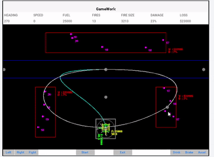

# HornetHFD-a3
This project is an OOP intensive helicopter game built with the codename one Java library. The goal of this game is for users to douse every fire after picking up water from the river. There's also a non-player helicopter that helps the player douse each fire, picking up water from the river and dousing any fire in its path.

